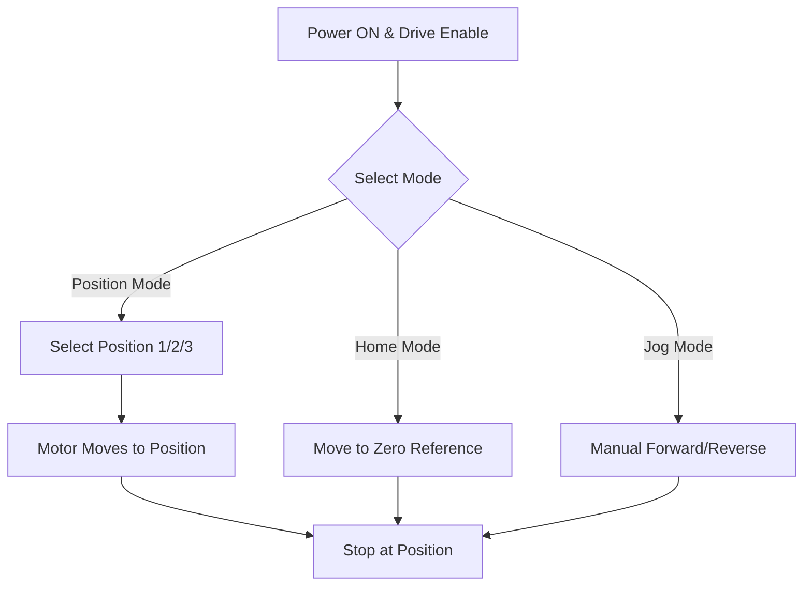

# 🚀 Servo Motor Movement Control Using PLC & HMI


https://github.com/user-attachments/assets/e03d6cc6-a093-4764-8190-e45e5abe53d3


🎥 **[Watch the Project Demonstration Video](https://github.com/tejascw/Servo-Motor-control_Project_Using_PLC-HMI/blob/main/servo_motor_video_demonstration.mp4)**


---

## 📖 Project Overview

This project demonstrates a **Servo Motor Movement Control System** designed using **PLC ladder logic** and **HMI interface**.
It is aimed at **precise motion control applications** in industrial automation such as conveyors, pick-and-place systems, and robotic arms.

The system supports:

* **Forward & Reverse Movement** with safety interlocks
* **Position Mode** for up to **three programmable positions**
* **Jog Mode** for manual positioning
* **Home Mode** for returning to initial reference
* **Real-time movement tracking** via counters
* **Safety & Emergency stop mechanisms**

---

## 📂 Repository Contents

### 🎬 **Demonstration Video**

* [`servo_motor_video_demonstration.mp4`](./servo_motor_video_demonstration.mp4)
  *(Shows the complete working of the system from HMI commands to motor response.)*

---

### ⚡ **PLC Program Files**

* [`Servo_moter_movement_project%201.gx3`](https://github.com/tejascw/Servo-Motor-control_Project_Using_PLC-HMI/blob/main/./Servo_moter_movement_project%201.gx3) — Main PLC project for **Mitsubishi GX Works3**.
* [`Servo_Motor_PLC_Progrmming_file.xml`](https://github.com/tejascw/Servo-Motor-control_Project_Using_PLC-HMI/blob/main//Servo_Motor_PLC_Progrmming_file.xml) — Full ladder logic in XML format.
* [`Servo_Motor_PLC_Progrmming_file.html`](https://github.com/tejascw/Servo-Motor-control_Project_Using_PLC-HMI/blob/main//Servo_Motor_PLC_Progrmming_file.html) — Ladder logic diagram in HTML format for web viewing.
* [`Servo_Motor_PLC_Progrmming_file.txt`](https://github.com/tejascw/Servo-Motor-control_Project_Using_PLC-HMI/blob/main//Servo_Motor_PLC_Progrmming_file.txt) — Textual representation of PLC logic.
* [`Servo_Motor_PLC_Progrmming_file.csv`](https://github.com/tejascw/Servo-Motor-control_Project_Using_PLC-HMI/blob/main//Servo_Motor_PLC_Progrmming_file.csv) — CSV-based program export.

---

### 🖥 **HMI Project**

* [`Servo_Motor_HMI_project.GTX`](https://github.com/tejascw/Servo-Motor-control_Project_Using_PLC-HMI/blob/main//Servo_Motor_HMI_project.GTX) — HMI design project for **Mitsubishi GT Designer3**.

---

### 🖼 **Images & Visual References**

| Image                                                                                      | Description                                 |
| ------------------------------------------------------------------------------------------ | ------------------------------------------- |
|                 |                   |
| Actual HMI interface design| Simulated HMI environment |
| _Motor_Movement_Simulation%20.jpg) | 
| Servo motor controlling conveyor simulation  |

---

## 🔄 Working Flow




## 🛠 Technical Details

### **1️⃣ Forward & Reverse Movement Control**

* Implemented using **M memory bits** and **Y outputs** for motor drive.
* Logic ensures:

  * Forward motion only when **Reverse** is OFF.
  * Reverse motion only when **Forward** is OFF.
* Forward: `Y1` Output → Motor moves forward.
* Reverse: `Y2` Output → Motor moves backward.

---

### **2️⃣ Position Mode**

* Allows selection of **Position 1, Position 2, or Position 3**.
* Controlled via HMI position buttons.
* Uses **data registers (D1, D2, D3)** for storing position values.
* Default position value **200** is set if no input is given.

---

### **3️⃣ Home Mode**

* Returns servo to **reference zero position**.
* Activated via **Home Enable** and **Home Start** signals.
* Overrides position and jog commands for safety.

---

### **4️⃣ Jog Mode**

* Manual control for moving servo **forward or reverse** without preset positions.
* Uses **Jog Forward** and **Jog Reverse** commands from HMI.

---

### **5️⃣ Counter & Position Tracking**

* **CTUD counter block** counts up and down based on servo direction.
* Current count value stored in **D0** register.
* Used for position validation and movement stopping.

---

### **6️⃣ Safety Interlocks**

* **Drive Enable / Disable**
* **Emergency Stop Switch**
* Movement possible only when:

  * Drive enabled
  * Emergency not active
  * No conflicting motion commands

---

## ⚙ Hardware & Software Setup

| Component                | Details                             |
| ------------------------ | ----------------------------------- |
| **PLC**                  | Mitsubishi Electric R00 Series      |
| **Programming Software** | GX Works3                           |
| **HMI Software**         | GT Designer3                        |


---


---

## 📜 Ladder Logic Snapshot

*(Partial forward movement control logic)*

```plaintext
// Forward Movement Logic
LD M0             // Power memory bit ON
LD M1             // Forward memory switch
ANI M2            // Reverse memory OFF
OUT Y1            // Activate forward output
```

https://drive.google.com/file/d/15Aqu7le0woJv72qmGnAa7W5TQT06NAls/view?usp=drive_link


---

## 🚀 How to Use

1. **Open PLC Program**: Load `.gx3` file in **GX Works3**.
2. **Load HMI**: Open `.GTX` file in **GT Designer3**.
3. **Connect Hardware**: Wire PLC to servo motor driver and HMI panel.
4. **Upload Programs**: Send PLC & HMI programs to respective devices.
5. **Operate via HMI**: Select mode, set position, and control motor.
6. **Monitor**: Watch counter and motor position values in real-time.

---

## 📌 Applications

* Automated conveyor systems
* Pick-and-place robots
* CNC machine positioning
* Packaging & material handling systems
* Industrial assembly lines

---

## 👨‍💻 Author

**Tejas Waghmare**
*Mechanical Engineer | PLC, HMI, SENSOR, Industrial Automation & Robotics Enthusiast*


