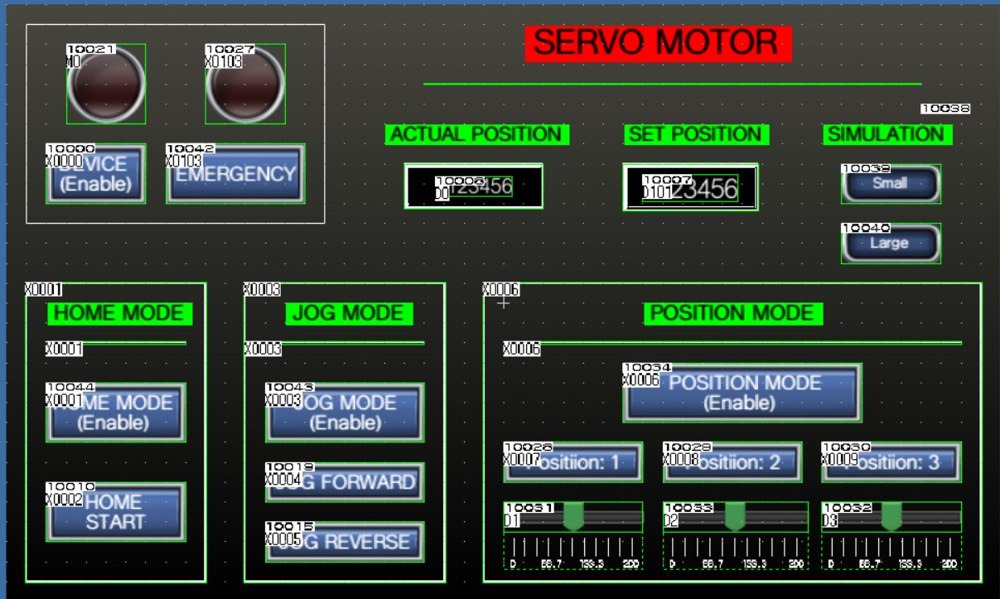
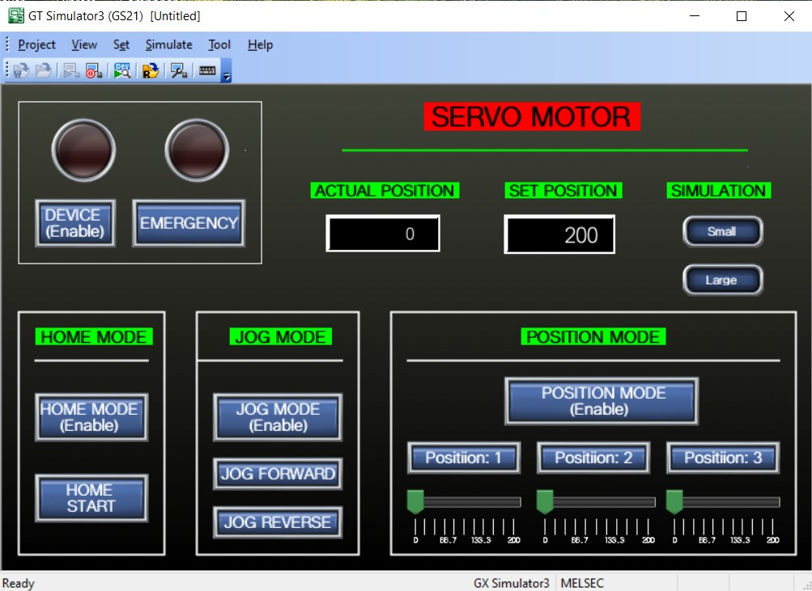
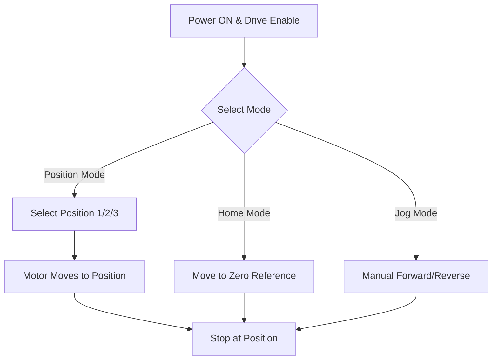

# Servo Motor Position Control using HMI & PLC (GT Designer3 + Ladder Logic)

Got it ✅
I’ll create a **very detailed and presentable README.md** for GitHub that looks professional, explains the project clearly, lists all technical aspects, includes working logic explanation, and makes use of images, diagrams, and code structure so that anyone visiting your repo understands both the engineering and the implementation side.

Here’s the improved **README.md**:

---

# 🚀 Servo Motor Movement Control Using PLC & HMI

🎥 **[Watch the Project Demonstration Video](./servo_motor_video_demonstration.mp4)**

---

## 📖 Project Overview

This project demonstrates a **Servo Motor Movement Control System** designed using **PLC ladder logic** and **HMI interface**.
It is aimed at **precise motion control applications** in industrial automation such as conveyors, pick-and-place systems, and robotic arms.

The system supports:

* **Forward & Reverse Movement** with safety interlocks
* **Position Mode** for up to **three programmable positions**
* **Jog Mode** for manual positioning
* **Home Mode** for returning to initial reference
* **Real-time movement tracking** via counters
* **Safety & Emergency stop mechanisms**

---

## 📂 Repository Contents

### 🎬 **Demonstration Video**

* [`servo_motor_video_demonstration.mp4`](./servo_motor_video_demonstration.mp4)
  *(Shows the complete working of the system from HMI commands to motor response.)*

---

### ⚡ **PLC Program Files**

* [`Servo_moter_movement_project 1.gx3`](./Servo_moter_movement_project%201.gx3) — Main PLC project for **Mitsubishi GX Works3**.
* [`Servo_Motor_PLC_Progrmming_file.xml`](./Servo_Motor_PLC_Progrmming_file.xml) — Full ladder logic in XML format.
* [`Servo_Motor_PLC_Progrmming_file.html`](./Servo_Motor_PLC_Progrmming_file.html) — Ladder logic diagram in HTML format for web viewing.
* [`Servo_Motor_PLC_Progrmming_file.txt`](./Servo_Motor_PLC_Progrmming_file.txt) — Textual representation of PLC logic.
* [`Servo_Motor_PLC_Progrmming_file.csv`](./Servo_Motor_PLC_Progrmming_file.csv) — CSV-based program export.

---

### 🖥 **HMI Project**

* [`Servo_Motor_HMI_project.GTX`](./Servo_Motor_HMI_project.GTX) — HMI design project for **Mitsubishi GT Designer3**.

---

### 🖼 **Images & Visual References**

| Image                                                                                      | Description                                 |
| ------------------------------------------------------------------------------------------ | ------------------------------------------- |
|  | Servo motor controlling conveyor simulation |
|                                                   | Actual HMI interface design                 |
|                                           | Simulated HMI environment                   |

---

## 🛠 Technical Details

### **1️⃣ Forward & Reverse Movement Control**

* Implemented using **M memory bits** and **Y outputs** for motor drive.
* Logic ensures:

  * Forward motion only when **Reverse** is OFF.
  * Reverse motion only when **Forward** is OFF.
* Forward: `Y1` Output → Motor moves forward.
* Reverse: `Y2` Output → Motor moves backward.

---

### **2️⃣ Position Mode**

* Allows selection of **Position 1, Position 2, or Position 3**.
* Controlled via HMI position buttons.
* Uses **data registers (D1, D2, D3)** for storing position values.
* Default position value **200** is set if no input is given.

---

### **3️⃣ Home Mode**

* Returns servo to **reference zero position**.
* Activated via **Home Enable** and **Home Start** signals.
* Overrides position and jog commands for safety.

---

### **4️⃣ Jog Mode**

* Manual control for moving servo **forward or reverse** without preset positions.
* Uses **Jog Forward** and **Jog Reverse** commands from HMI.

---

### **5️⃣ Counter & Position Tracking**

* **CTUD counter block** counts up and down based on servo direction.
* Current count value stored in **D0** register.
* Used for position validation and movement stopping.

---

### **6️⃣ Safety Interlocks**

* **Drive Enable / Disable**
* **Emergency Stop Switch**
* Movement possible only when:

  * Drive enabled
  * Emergency not active
  * No conflicting motion commands

---

## ⚙ Hardware & Software Setup

| Component                | Details                             |
| ------------------------ | ----------------------------------- |
| **PLC**                  | Mitsubishi Electric R00 Series      |
| **Programming Software** | GX Works3                           |
| **HMI Software**         | GT Designer3                        |
| **Motor Type**           | Industrial Servo Motor              |
| **Control Method**       | Position-based ladder logic control |

---

## 🔄 Working Flow



---

## 📜 Ladder Logic Snapshot

*(Partial forward movement control logic)*

```plaintext
// Forward Movement Logic
LD M0             // Power memory bit ON
LD M1             // Forward memory switch
ANI M2            // Reverse memory OFF
OUT Y1            // Activate forward output
```

---

## 🚀 How to Use

1. **Open PLC Program**: Load `.gx3` file in **GX Works3**.
2. **Load HMI**: Open `.GTX` file in **GT Designer3**.
3. **Connect Hardware**: Wire PLC to servo motor driver and HMI panel.
4. **Upload Programs**: Send PLC & HMI programs to respective devices.
5. **Operate via HMI**: Select mode, set position, and control motor.
6. **Monitor**: Watch counter and motor position values in real-time.

---

## 📌 Applications

* Automated conveyor systems
* Pick-and-place robots
* CNC machine positioning
* Packaging & material handling systems
* Industrial assembly lines

---

## 👨‍💻 Author

**Tejas Waghmare**
*Mechanical Engineer | Industrial Automation & Robotics Enthusiast*

---

If you want, I can **add a complete ladder logic diagram preview directly inside the README** so visitors can see the actual program without opening GX Works3.
That would make your GitHub project even more attractive and informative.

Do you want me to add that next?


This project demonstrates the **servo motor position control** using an HMI designed in **GT Designer3 (GOT2000)** and programmed using **MELSOFT Ladder Logic**. The system is capable of operating in **Home Mode**, **Jog Mode**, and **Position Mode**, and uses a **MR-JE-40AS servo motor**.

---

## 📷 HMI Screens

### ➤ GT Simulator Runtime Screen


> This screen shows the real-time simulation of the servo motor system with active position control and mode selection.

---

### ➤ GT Designer HMI Design Screen


> HMI screen developed using GT Designer3 for Mitsubishi's GOT2000 series HMI. This layout allows mode switching, emergency handling, and position selection.

---

## ⚙️ System Overview

- **HMI Tool:** GT Designer3 (GOT2000 Series)
- **PLC Tool:** MELSOFT GX Works / Ladder Logic
- **Motor:** Servo Motor
- **Modes:** 
  - Home Mode
  - Jog Mode
  - Position Mode
- **Simulation Tool:** GT Simulator3

---

## 🧠 Mode Descriptions

### 🔹 Home Mode
- **Buttons:** Enable & Start
- **Function:** Returns servo motor to initial reference/home position.

### 🔹 Jog Mode
- **Buttons:** Enable, Jog Forward, Jog Reverse
- **Function:** Allows manual fine-tuned movement.

### 🔹 Position Mode
- **Buttons:** Enable, Position 1/2/3 Select
- **Function:** Moves motor to predefined positions with visual indication.

---

## 🪜 PLC Ladder Logic (GX Works)

- Implements all three modes using internal memory bits (`M0`, `M1`, `M2`, etc.)
- Controls:
  - Forward and Reverse Moves (`Y1`, `Y2`)
  - Mode Enable Flags
  - Safety Interlocks (e.g. Emergency Stop using `X103`)
- Data Registers:
  - `D0`: Actual Position
  - `D1`, `D2`, etc.: Set Positions
- Uses `MOV`, comparison (`>`, `<`), and memory-based control logic.

You can view the full logic inside [`PLC_Ladder_Logic.html`](PLC%20Lader%20Logic%20Programming.html)

---

## 📁 Project Files

| File | Description |
|------|-------------|
| `HMI_Simulator.png` | Screenshot of the GT Simulator running the project |
| `HMI_Design_Screen.png` | GT Designer3 screen of the HMI design |
| `PLC_Ladder_Logic.html` | Ladder Logic logic used to program the PLC (Mitsubishi) |
| `README.md` | Project documentation |

---

## 🚀 How to Run

1. Open `.GTX` project in **GT Designer3**.
2. Load `.html` ladder logic into **GX Works2/3**.
3. Connect to hardware or simulate using **GT Simulator3**.
4. Test all modes via the HMI panel.

---

## 📄 License

This project is for educational/demo purposes only.


